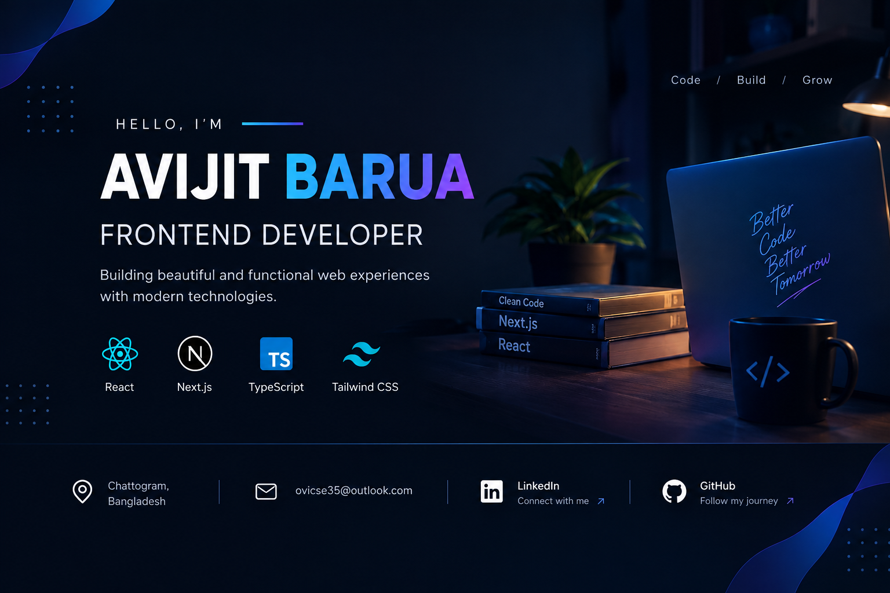

<div align="center">



# Hi 👋, I'm Avijit Barua

### Frontend Developer | React • Next.js • TypeScript

<p>
  I enjoy building modern, responsive, and user-friendly web applications
  with clean UI and practical functionality.
</p>

</div>

---

## 👨‍💻 About Me

I'm a **Frontend Developer** focused on building modern web applications with React and Next.js.

* 🚀 Currently building projects with **React, Next.js & TypeScript**
* 🌱 Exploring modern frontend development and best practices
* 💻 Building responsive and user-friendly web applications
* 📚 Continuously improving my JavaScript and problem-solving skills
* 🎯 Working towards becoming a stronger full-stack developer

---

## 🛠️ Skills & Technologies

<div align="center">

[](https://skillicons.dev)

</div>

---

## 🤝 Connect With Me

<div align="center">

<a href="mailto:ovicse35@outlook.com">
  
</a>

<a href="https://www.linkedin.com/in/avijit-barua-7a10691a8">
  
</a>

<a href="https://github.com/Avijit35cse">
  
</a>

</div>

---

## 📊 GitHub Stats

<div align="center">


<br><br>


</div>

<br>

<div align="center">

### ⚡ Technologies I Work With


</div>

---

## 🚀 Featured Projects

### 🏋️ FitLog — Workout Library

A modern dark-themed workout library built with **Next.js, TypeScript and Tailwind CSS**.

**Highlights:**

* 🏋️ Workout library with detailed exercise information
* 📋 Add workouts to today's plan
* 🔖 Save workouts for later
* 💾 LocalStorage persistence
* 🔍 Search and sorting functionality
* 📱 Responsive design for mobile, tablet and desktop
* 🔔 Toast notifications

**Tech Stack:** Next.js • TypeScript • Tailwind CSS • React • LocalStorage

[🌐 Live Demo](https://b14-a6-fit-log-opal-xi.vercel.app/) • [📂 GitHub Repository](https://github.com/Avijit35cse/B14-A6-Fit-Log)

---

### 🧑‍💻 Dev-Stack

A modern developer-focused web application built with **React and modern frontend technologies**.

**Highlights:**

* 💻 Developer-focused web interface
* 🎨 Clean and modern UI
* 📱 Responsive design
* ⚡ Modern frontend development
* 🚀 Deployed on Netlify

**Tech Stack:** React • JavaScript • Tailwind CSS

[🌐 Live Demo](https://dev-stack-avijit.netlify.app/)

---

## 💡 What I'm Learning

```text
React
  ↓
Next.js
  ↓
TypeScript
  ↓
Advanced Frontend Development
  ↓
Full-Stack Development
```

---

### 🚀 Code • Build • Learn • Grow

**Thanks for visiting my profile!** ⭐
